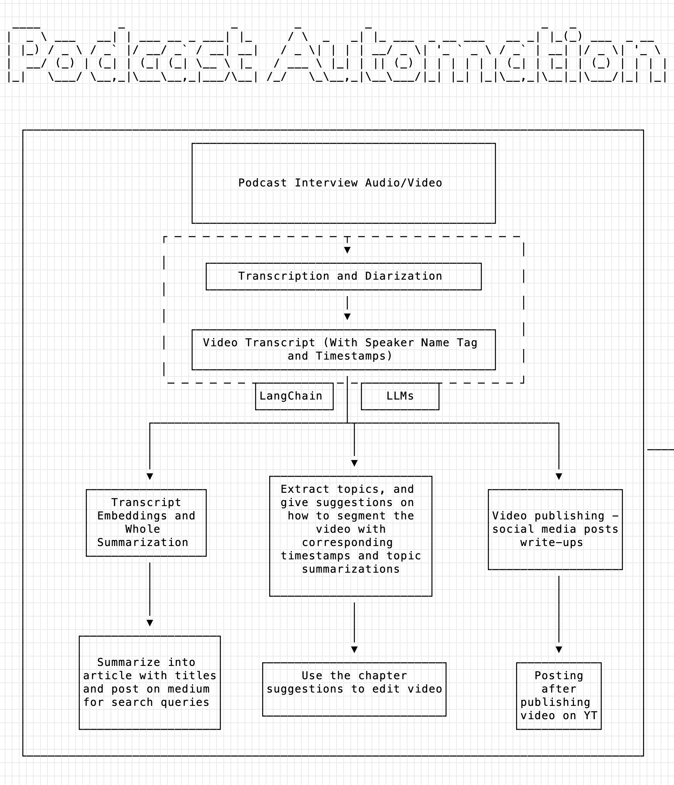

# Podcast Editing Automation With LLMs

This project explores automating the process of editing podcast interviews with the help of AI models.
Usually, the process of editing a podcast interview content comes down to:
1. Split audio from video
2. Generate accurate transcripts with correct speaker names
3. Analyze the interview (video/audio) and edit it into multiple clips with each has a specific topic or highlight
4. Generate Chapters for each of the clip as well
5. Write an article about the interview to publish on media such as Medium
6. Write out intriguing social media posts for each clip to spread it out in public

This project aims to automate most of the editing work with multiple AI models, including [Whisper](https://github.com/openai/whisper) from OpenAI, [WhisperX](https://github.com/m-bain/whisperX) from Oxford University, LLMs such as Claude or GPT3.5 and GPT4 (API), and other useful tools such as [LangChain](https://python.langchain.com/docs/get_started/introduction.html) and VectorDBs. 
Below is a rough draft of the system design of this project:  

  

Environment Setup: 
Suggested Python Version: 3.10 & PyTorch 2.0 to match WhisperX

## Part I: Video Transcription and Speaker Diarization with Whisper/WhisperX

Refer to Audio_Transcript Folder (current code is a little sloppy, will be improved over time)
- You can extract audio from the video with `video_to_audio.py`
- Audio transcription and diarization (speaker assignment) with `video_transcription.py` (Need [Whisper](https://github.com/openai/whisper) and [WhisperX](https://github.com/m-bain/whisperX) properly installed and imported)
  - Customize your input and output file path for the transcript in the python script, and you can also determine whether to use CPU or GPU for the transcription task (In our case we used CPU)
  - You also will need your `Hugging Face access token` and accept the user agreements for couple models for accessing WhisperX, you can check out the `WhisperX` github repo for more info. 
- After running the code and get your transcript, you still need to replace the speaker label with thier real names or any names you customized. This can be done with `speaker_correction.py` where you will be prompted to enter the speaker mappings in a `dict` and the script will do the job for you and save the corrected transcript to the output path you defined. 

## Part II: Working with LLMs and LangChain